<div align="center">
  

  # Simple Calculator App

  A basic Python calculator to demonstrate simple CI/CD concepts with GitHub Actions.
</div>

## Features

- Basic arithmetic operations (add, subtract, multiply, divide)
- Interactive mode for user input
- Automated testing with CI/CD
- Simple and clean codebase

## How It Works (The Simple Version)

Think of the calculator like a **helper robot**. You tell it what to do (add, subtract, multiply, or divide), give it two numbers, and it gives you the answer back.

**Under the Hood**: The calculator is built using a `Calculator` class that keeps all the math operations organized in one place. Each operation is a separate method that knows exactly how to do its job. When you divide by zero, it politely stops you because that would break math!

## Architecture

Here's how the pieces fit together:


**What This Means**:
- You give the calculator two numbers and tell it what to do
- The calculator has a "brain" (the Calculator class) with different skills
- Each skill does one thing really well
- The division skill has a safety check to prevent math errors

## Feature Tracker

This table shows what the calculator can do and explains each feature simply:

| Feature | Simple Explanation | Tech Details | Status |
|---------|-------------------|--------------|--------|
| **Interactive Mode** | Type in your own math problems | Command-line interface with input prompts | ✅ Done |
| **pytest Testing** | Modern test framework with simple syntax | 5 test cases using `pytest` with fixtures | ✅ Done |
| **AI Instructions** | Helps AI assistants understand the project rules | `.copilot-instructions.md` with project guidelines | ✅ Done |
| **Logo** | A friendly calculator robot mascot | Image in `assets/logo.png` displayed at top of README | ✅ Done |
| **Git Ignore** | Keeps temporary and personal files out of Git | `.gitignore` blocks Python cache, IDE settings, etc. | ✅ Done |
| **Main Branch** | Uses "main" instead of "master" for the default branch | Modern Git convention, set via GitHub CLI | ✅ Done |
| **Folder Structure** | Organized folders for code, tests, docs, and assets | Professional package layout: `calculator/`, `tests/`, `docs/`, `assets/` | ✅ Done |
| **uv Support** | Modern fast package manager (10-100x faster than pip!) | `pyproject.toml` for modern Python packaging | ✅ Done |
| **Test Reports** | Pretty HTML reports after running tests | Auto-generated in `reports/` folder (git-ignored) | ✅ Done |
| **Allure Reporting** | Enterprise test reporting with trends & history | Track test quality over time, detect flaky tests | ✅ Done |
| **CI/CD Pipeline** | GitHub Actions automatically runs tests & publishes reports | Multi-layer caching (3x faster!), gh-pages history | ✅ Done |
| **GitHub Pages** | Free website hosting - anyone can see your test reports! | gh-pages branch serves Allure reports automatically | ✅ Done |
| **Comprehensive Docs** | 8 documentation files explaining everything | ARCHITECTURE.md has complete system overview | ✅ Done |
| **Contributors Recognition** | Acknowledges AI tools that helped build this project | All-contributors system with GitHub Copilot & Claude Code | ✅ Done |
| **Pre-commit Hooks** | Code quality & security checks before every commit | Gitleaks (secrets), Ruff (linting), file validation + CI integration | ✅ Done |

## Quick Start

### Install Dependencies

**Using pip (traditional)**:
```bash
pip install -r requirements.txt
```

**Using uv (modern & fast)** ⚡:
```bash
uv pip install -e ".[dev]"
```

> **What's uv?** A super-fast Python package manager (10-100x faster than pip!). See [`docs/UV.md`](docs/UV.md) for details.

### Run the Calculator

```bash
python -m calculator.calculator
```

This will show a demo and then enter interactive mode where you can perform calculations.

### Run Tests

**Quick test** (pytest-html):
```bash
pytest
```

**Enterprise reporting** (Allure with trends):
```bash
pytest --alluredir=allure-results
allure serve allure-results
```

For more options:
```bash
pytest -v              # Verbose output
pytest --cov           # With coverage report
```

After running tests, check `reports/test-report.html` for a quick visual report!
Or use Allure for enterprise-level reporting with trends 📊

**Automated CI/CD**: Every push to `main` automatically runs tests and publishes Allure reports to GitHub Pages with history tracking!

📊 **Live Report**: https://guitaristforever.github.io/simple-calculator-demo/

See [`docs/ALLURE.md`](docs/ALLURE.md), [`docs/CI-CD.md`](docs/CI-CD.md), and [`docs/GITHUB-PAGES.md`](docs/GITHUB-PAGES.md) for details.

## Pre-commit Hooks

**Simple Explanation**: Think of pre-commit hooks as airport security for your code - they check everything before it "boards the plane" (gets committed). They catch secrets, fix formatting, and ensure quality automatically!

**Setup** (one-time):
```bash
pip install pre-commit
pre-commit install
```

**Usage**: Hooks run automatically on every commit! Or run manually:
```bash
pre-commit run --all-files
```

### What's Protected

| Hook | What It Does |
|------|-------------|
| 🔒 Gitleaks | Prevents committing secrets/API keys |
| 🐍 Ruff Linter | Checks Python code quality |
| 🎨 Ruff Formatter | Auto-formats Python code |
| ✂️ Whitespace | Removes trailing spaces |
| 📝 End-of-file | Ensures files end with newline |
| 📦 Import Sort | Organizes Python imports |
| 🔑 Private Keys | Detects SSH/SSL keys |
| 📦 Large Files | Prevents files >500KB |
| 🔀 Merge Conflicts | Catches conflict markers |

**Tech Details**: Pre-commit runs security checks (gitleaks), Python linting (ruff), and file validation automatically. Also runs in CI via GitHub Actions to ensure all commits are clean!

## Usage Examples

### Basic Operations

```python
from calculator import Calculator

calc = Calculator()

# Addition
result = calc.add(5, 3)        # Returns: 8

# Subtraction
result = calc.subtract(10, 4)  # Returns: 6

# Multiplication
result = calc.multiply(6, 7)   # Returns: 42

# Division
result = calc.divide(15, 3)    # Returns: 5.0
```

### Interactive Mode

When you run `python calculator.py`, you'll see:

```
Simple Calculator Demo
======================
5 + 3 = 8
10 - 4 = 6
6 * 7 = 42
15 / 3 = 5.0

Interactive Mode (type 'quit' to exit):
Enter operation (add/subtract/multiply/divide): add
Enter first number: 10
Enter second number: 5
Result: 15.0
```

## CI/CD Pipeline

This project uses GitHub Actions for continuous integration:

- **Automated Testing**: Runs unit tests on every push and pull request
- **Multi-Python Support**: Tests against Python 3.8, 3.9, 3.10, and 3.11
- **Simple Workflow**: Just pushes trigger the pipeline automatically

### How It Works (Simple Version)

Think of it like a **robot assembly line**:
1. 📝 You push code to GitHub
2. 🤖 Robot wakes up and runs all tests
3. 📊 Creates a beautiful report
4. 🌐 Publishes it to the internet
5. 🔗 Gives you a link to share!

### The Complete Process

```mermaid
flowchart TD
    Start[👨‍💻 Push Code to GitHub] --> Trigger[🚀 GitHub Actions Triggered]

    Trigger --> Job1[📦 Job 1: Test & Build]

    subgraph TestJob["Test & Build Report"]
        Setup[⚙️ Setup Environment<br/>Python + Node.js + Dependencies] --> RunTests[🧪 Run Tests with pytest]
        RunTests --> Results[📁 Generate allure-results/]

        Results --> GetHistory[📚 Fetch History from gh-pages]
        GetHistory --> MergeHistory[🔄 Merge with Previous History]

        MergeHistory --> GenReport[📊 Generate Allure 3 Report<br/>with Trends & History]
        GenReport --> Upload[⬆️ Upload Report Artifact]
    end

    Job1 --> TestJob
    TestJob --> Job2{🌐 Deploy?}

    Job2 -->|main branch only| Deploy[📤 Job 2: Deploy to GitHub Pages]
    Job2 -->|PR| Skip[⏭️ Skip Deploy<br/>Report in Artifacts]

    Deploy --> Configure[⚙️ Configure Pages]
    Configure --> Publish[🚀 Publish to gh-pages]
    Publish --> Live[✅ Live Report at GitHub Pages URL]

    Live --> Share[🔗 https://username.github.io/repo/]

    Skip --> ViewArtifact[👀 View in Actions Artifacts]

    style Start fill:#e1f5ff
    style Live fill:#d4edda
    style Share fill:#d4edda
    style TestJob fill:#fff3cd
    style Deploy fill:#f8d7da
```



**What This Means**:
- **Automatic**: Happens on every push, no manual work needed
- **Fast**: Multi-layer caching makes it run in ~15 seconds (3x faster!)
- **Historical**: Tracks trends over time, detects flaky tests
- **Free**: GitHub provides hosting and automation for free
- **Shareable**: Anyone can view your test reports via URL

## Project Structure

```
.
├── calculator/              # 🧠 Calculator app package
│   ├── __init__.py         # Makes it a Python package
│   └── calculator.py       # Calculator class and logic
├── tests/                   # ✅ All test files
│   └── test_calculator.py  # Calculator unit tests
├── docs/                    # 📚 Documentation
│   ├── ARCHITECTURE.md     # 🏗️  Complete system overview
│   ├── STRUCTURE.md        # Folder structure explained
│   ├── TESTING.md          # pytest guide
│   ├── UV.md               # Modern package management
│   ├── ALLURE.md           # Enterprise test reporting
│   ├── CI-CD.md            # GitHub Actions automation
│   └── GITHUB-PAGES.md     # 🌐 Free website hosting explained
├── .github/
│   └── workflows/
│       └── tests.yml       # Automated testing with Allure
├── assets/                  # 🎨 Images and media
│   └── logo.png            # Calculator robot logo
├── reports/                 # 📊 Test reports (auto-generated, git-ignored)
│   ├── test-report.html    # HTML test report
│   └── junit.xml           # JUnit XML report for CI/CD
├── .copilot-instructions.md # 🤖 AI guidance
├── .gitignore              # 🚫 Git ignore rules
├── pyproject.toml          # 📋 Modern project config (uv, pytest, metadata)
├── pytest.ini              # ⚙️  pytest configuration (legacy)
├── requirements.txt        # 📦 Python dependencies (pip compatible)
└── README.md               # 👋 This file
```

**Why this structure?** Each type of file has its own home - code, tests, docs, and media are all separated. Makes it easy to find things as the project grows!

**Want the full picture?** See [`docs/ARCHITECTURE.md`](docs/ARCHITECTURE.md) for the complete system overview!
**Just folder details?** See [`docs/STRUCTURE.md`](docs/STRUCTURE.md)

## Contributing

1. Fork the repository
2. Create a feature branch
3. Make your changes
4. Run the tests: `pytest`
5. Submit a pull request

The CI pipeline will automatically run tests on your pull request.

## License

This project is for educational purposes.
