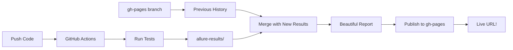

# CI/CD with GitHub Actions 🚀

## What is CI/CD? (Simple Version)

**CI/CD** = **Continuous Integration / Continuous Delivery**

Think of it like having a **robot assistant** that:
1. 🤖 Watches your code changes
2. ✅ Automatically runs all tests
3. 📊 Creates beautiful reports
4. 🌐 Publishes them online
5. 📈 Tracks history over time

**Without CI/CD**: You manually run tests, create reports, share them  
**With CI/CD**: Robot does it all automatically every time you push code!

## Our Setup: Tests with Allure History

Every time you push code to GitHub:
1. ✅ GitHub Actions runs automatically
2. 🧪 Runs all 5 calculator tests
3. 📊 Generates Allure report
4. 📈 Merges with previous history (trends!)
5. 🌐 Publishes to GitHub Pages
6. 🔗 You get a URL to share!

## How It Works (The Magic)



### The Secret: gh-pages Branch

**Simple Version**: GitHub has a special branch called `gh-pages` that:
- Stores your test reports
- Keeps history of previous runs
- Serves them as a website (GitHub Pages)

**How History Works**:
```
Run 1: Test results → Save to gh-pages → History: [Run1]
Run 2: Pull gh-pages → Test results → Save → History: [Run1, Run2]
Run 3: Pull gh-pages → Test results → Save → History: [Run1, Run2, Run3]
```

Each run adds to the history! That's how we get trends! 📈

## Viewing Your Reports

### Option 1: GitHub Actions UI
1. Go to your repo on GitHub
2. Click "Actions" tab
3. Click on any workflow run
4. Scroll down to "Artifacts" or check the deployment

### Option 2: GitHub Pages URL
After first run, your report will be at:
```
https://[your-username].github.io/[repo-name]/
```

Example:
```
https://guitaristforever.github.io/simple-calculator-demo/
```

## The Workflow File

Located at `.github/workflows/tests.yml`:

### When It Runs
```yaml
on:
  push:
    branches: [ main ]      # Every push to main
  pull_request:             # Every pull request
  workflow_dispatch:        # Manual trigger button
```

### Performance: Caching ⚡

The workflow uses **multiple caching layers** for speed:

**Pip Cache**:
```yaml
cache: 'pip'
cache-dependency-path: 'requirements.txt'
```
- Caches Python packages
- Only re-downloads if `requirements.txt` changes
- **~30s faster** per run!

**pytest Cache**:
```yaml
path: .pytest_cache
key: ${{ runner.os }}-pytest-${{ hashFiles('tests/**/*.py') }}
```
- Caches pytest's internal cache
- Speeds up test collection
- Only invalidates when test files change

**Result**: 
- **First run**: ~45s (installs everything)
- **Cached runs**: ~15s (uses cached packages!)
- **3x faster!** 🚀

### What It Does

**Step 1: Setup**
- Checks out your code
- Installs Python 3.9
- Installs dependencies (with caching!)

**Step 2: Run Tests**
```bash
pytest --alluredir=allure-results -v
```
Generates test results in Allure format

**Step 3: Get History**
```yaml
- name: Checkout gh-pages for history
  uses: actions/checkout@v4
  with:
    ref: gh-pages  # Pull the gh-pages branch
    path: gh-pages  # Put it in gh-pages folder
```

**Step 4: Generate Report with History**
```yaml
- name: Generate Allure Report with History
  uses: simple-elf/allure-report-action@v1.13
  with:
    allure_results: allure-results  # New results
    gh_pages: gh-pages              # Old history
    allure_history: allure-history  # Merged output
    keep_reports: 20                # Keep last 20 runs
```

**Step 5: Publish**
```yaml
- name: Deploy to GitHub Pages
  uses: JamesIves/github-pages-deploy-action@v4
  with:
    branch: gh-pages
    folder: allure-history
    clean: false
```

> **Why JamesIves action?** More reliable for first-time deployments and handles edge cases better than alternatives.

## What You Get

### After First Push
- ✅ Tests run automatically
- ✅ Report generated
- ✅ Published to GitHub Pages
- ✅ URL available to share

### After Multiple Pushes
- ✅ All of the above, PLUS:
- 📈 **Trend graphs** showing success rate over time
- ⏱️ **Duration tracking** for performance regression
- 🔍 **Flaky test detection** (tests that sometimes fail)
- 📊 **Historical comparison** of test runs

## Enabling GitHub Pages

### First Time Setup
1. Go to your repo on GitHub
2. Click **Settings** → **Pages**
3. Under "Source":
   - Branch: `gh-pages`
   - Folder: `/ (root)`
4. Click **Save**

After the first workflow run, GitHub Pages will automatically serve your reports!

## Manual Trigger

Want to run tests without pushing code?

1. Go to **Actions** tab on GitHub
2. Click **"Tests with Allure Reports"**
3. Click **"Run workflow"** button
4. Select branch
5. Click **"Run workflow"**

Done! Tests run and report publishes.

## Why This Matters (Sophisticated Version)

### Professional CI/CD Practices

1. **Automated Testing**
   - No manual test runs
   - Consistent environment
   - Test on every change

2. **Historical Tracking**
   - See test trends over time
   - Identify degrading tests
   - Performance regression detection

3. **Artifact Storage**
   - Test reports preserved
   - Accessible via URL
   - No local storage needed

4. **Collaboration**
   - Share test results with team
   - PR checks automatically
   - Visual feedback

### Cost: $0

- GitHub Actions: Free for public repos (2000 minutes/month)
- GitHub Pages: Free hosting
- No external services needed

### Industry Standard

This setup demonstrates:
- ✅ Modern CI/CD workflow
- ✅ Automated quality gates
- ✅ Test report archival
- ✅ Trend analysis
- ✅ Zero-maintenance hosting

Same approach used by professional teams at scale!

## Badges (Optional)

Add a test status badge to your README:

```markdown

```

Shows: 

## Troubleshooting

### Report Not Showing?
1. Check Actions tab for errors
2. Ensure gh-pages branch exists
3. Check Settings → Pages is enabled

### No History/Trends?
- History appears after 2+ runs
- First run creates initial data point
- Need gh-pages branch to persist

### Tests Failing?
- Workflow continues even if tests fail (for demo)
- Report still generates showing failures
- Check Actions logs for details

## Advanced: Multiple Environments

Want to test on Python 3.8, 3.9, 3.10?

```yaml
strategy:
  matrix:
    python-version: ['3.8', '3.9', '3.10', '3.11']
```

Creates 4 parallel test jobs, all reporting to same Allure dashboard!

## The Power: History in Git

**Why gh-pages?**
- Git-based storage (version controlled)
- Free hosting (GitHub Pages)
- Automatic cleanup (keep last N reports)
- No external dependencies
- Works offline (can clone gh-pages)

**Alternative**: Could use external services (Allure TestOps, ReportPortal), but those cost money and add complexity. gh-pages is free and integrated! 🎉

## Summary

You now have:
- ✅ Automated testing on every push
- ✅ Beautiful Allure reports online
- ✅ Historical trends (after 2+ runs)
- ✅ Shareable URL
- ✅ Zero cost
- ✅ Professional CI/CD setup

**For a simple calculator!** That's the sophistication! 🚀
