# GitHub Pages 🌐

## What is GitHub Pages? (Explain Like I'm 5)

Imagine you have a **cool drawing** and you want everyone to see it.

**Without GitHub Pages**: You'd have to show each person your notebook one at a time.

**With GitHub Pages**: You put your drawing in a **magic window** that everyone in the world can see just by visiting a special address (URL)!

```
Your files → GitHub Pages → Website anyone can visit! 🎉
```

---

## What is GitHub Pages? (Technical Version)

GitHub Pages is a **free static website hosting service** built into GitHub.

- **Static** = HTML, CSS, JS files (no server-side code like PHP/Python)
- **Free** = Zero cost for public repos
- **Automatic** = Deploys directly from a branch

### Your Report URL

```
https://guitaristforever.github.io/simple-calculator-demo/
```

This URL pattern:
```
https://[username].github.io/[repository-name]/
```

---

## How We Use GitHub Pages

### The Problem
We want to:
1. Run tests automatically ✅
2. Generate beautiful Allure reports ✅
3. **Share them with anyone** ❓

### The Solution: gh-pages Branch

```mermaid
flowchart TD
    A[Push code to main] --> B[GitHub Actions runs]
    B --> C[Tests run]
    C --> D[Allure report generated]
    D --> E[Report saved to gh-pages branch]
    E --> F[GitHub Pages serves it]
    F --> G[🌐 Anyone can see your report!]
```



---

## The gh-pages Branch: Your Website Storage

### Simple Explanation

Think of branches like **folders**:
- `main` branch = Your code
- `gh-pages` branch = Your website files

GitHub automatically serves anything in `gh-pages` as a website!

### What's Inside gh-pages

```
gh-pages/
├── index.html          ← Entry point (redirects to latest report)
├── last-history/       ← History data for trends
├── 1/                  ← Report from run #1
├── 2/                  ← Report from run #2
├── 3/                  ← Report from run #3
│   ├── index.html      ← The actual report
│   ├── data/           ← Test results data
│   ├── widgets/        ← Charts and graphs
│   └── history/        ← Trend data
└── ...
```

Each workflow run creates a numbered folder with that run's report!

---

## How History Works

### Run 1 (First Time)
```
1. Tests run → results generated
2. No previous history (first time)
3. Save results to gh-pages/1/
4. Website shows: Run 1 only
```

### Run 2 (History Begins!)
```
1. Tests run → results generated
2. Pull gh-pages branch (has Run 1)
3. Merge Run 1 history + Run 2 results
4. Save to gh-pages/2/
5. Website shows: Run 1, Run 2 with TRENDS! 📈
```

### Run 10 (Full History)
```
Website shows all 10 runs with:
- Pass/fail trends over time
- Duration trends (getting slower?)
- Flaky test detection
- Historical comparison
```

---

## The Workflow (How It Deploys)

### Step 1: Get Previous History
```yaml
- name: Get Allure history
  uses: actions/checkout@v4
  with:
    ref: gh-pages      # Pull the gh-pages branch
    path: gh-pages     # Put it in a folder called "gh-pages"
```

This fetches your previous reports (for history/trends).

### Step 2: Generate Report with History
```yaml
- name: Build Allure Report
  uses: simple-elf/allure-report-action@v1.13
  with:
    allure_results: allure-results  # New test results
    gh_pages: gh-pages              # Previous history
    allure_history: allure-history  # Output folder
    keep_reports: 20                # Keep last 20 runs
```

This creates a new report that **includes history from all previous runs**.

### Step 3: Deploy to GitHub Pages
```yaml
- name: Deploy to GitHub Pages
  uses: JamesIves/github-pages-deploy-action@v4
  with:
    branch: gh-pages           # Target branch
    folder: allure-history     # What to deploy
    clean: false               # Don't delete old files
```

This pushes everything to the `gh-pages` branch, making it live instantly!

---

## Enable GitHub Pages (One-Time Setup)

### Via GitHub UI

1. Go to your repo on GitHub
2. Click **Settings** ⚙️
3. Scroll to **Pages** (left sidebar)
4. Under "Build and deployment":
   - **Source**: Deploy from a branch
   - **Branch**: `gh-pages`
   - **Folder**: `/ (root)`
5. Click **Save**

### Via GitHub CLI
```bash
gh api repos/[owner]/[repo]/pages -X POST -f source='{"branch":"gh-pages","path":"/"}'
```

---

## Why gh-pages? Why Not Something Else?

| Option | Cost | Complexity | History |
|--------|------|------------|---------|
| **gh-pages** | Free ✅ | Simple ✅ | Built-in ✅ |
| AWS S3 | $ | Medium | Manual |
| Netlify | Free tier | Easy | Manual |
| Allure TestOps | $$$ | Medium | Built-in |

**gh-pages wins** because:
- 🆓 Completely free
- 🔗 Direct GitHub integration
- 📈 History stored in Git (version controlled!)
- 🚀 Automatic deployment
- 🔒 No external accounts needed

---

## Troubleshooting

### "Page not found" (404)

**Causes**:
1. GitHub Pages not enabled in Settings
2. gh-pages branch doesn't exist yet
3. First workflow run hasn't completed

**Fix**: Enable Pages in Settings → Pages

---

### Report Shows But No History/Trends

**Cause**: Only 1 run so far

**Fix**: Push another commit! History appears after 2+ runs.

---

### Old Report Showing

**Cause**: Browser cache

**Fix**: Hard refresh (Cmd+Shift+R / Ctrl+Shift+R)

---

### Deployment Failed

**Check**:
```bash
gh run view --log-failed
```

**Common issues**:
- Permissions (need `contents: write` in workflow)
- Branch protection rules blocking push

---

## The Magic Behind the URL

When you visit:
```
https://guitaristforever.github.io/simple-calculator-demo/
```

What happens:
1. GitHub receives the request
2. Looks at `gh-pages` branch of `simple-calculator-demo` repo
3. Finds `index.html` at root
4. Serves it to your browser
5. Allure report loads! 🎉

It's like GitHub is running a mini web server for you, for free!

---

## Summary

### GitHub Pages = Free Website Hosting

```
Your repo's gh-pages branch → Free website at github.io
```

### How We Use It

```
Tests run → Allure report → Push to gh-pages → Live website!
```

### What You Get

- 🌐 **Live URL** anyone can access
- 📈 **Historical trends** (after 2+ runs)
- 💰 **Zero cost**
- 🔄 **Automatic updates** on every push
- 🔗 **Shareable link** for your team

---

## Your Report URL

### 👉 https://guitaristforever.github.io/simple-calculator-demo/

Bookmark it! Share it! Every push to `main` updates it automatically! 🚀
