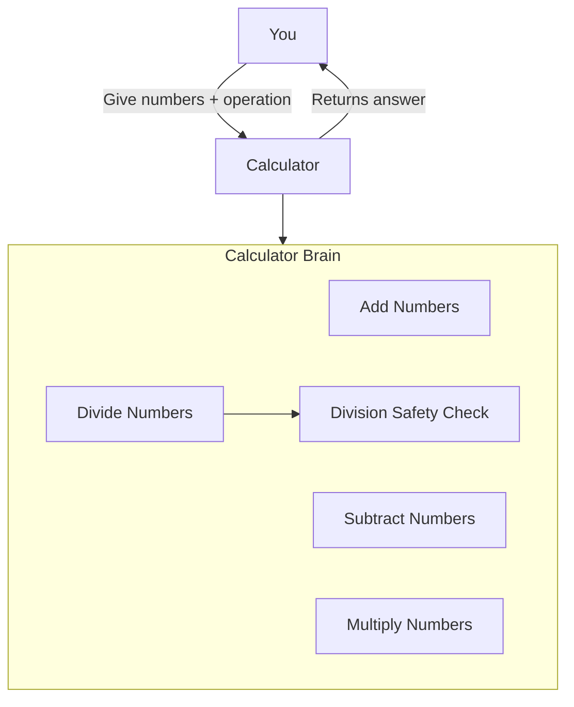

# Guide 2: Understanding the Code 🧠

**You've run the calculator.** Now let's understand how it works!

---

## What You'll Learn

In this guide, you'll:
1. ✅ See how the calculator is organized
2. ✅ Understand the Calculator class
3. ✅ Learn why it's built this way

**Time needed**: 10 minutes

---

## The Simple Explanation (ELI5)

Think of the calculator like a **helper robot**:
- You tell it what to do (add, subtract, multiply, or divide)
- Give it two numbers
- It gives you the answer back

That's it! But let's see how it's built...

---

## The Code Structure

```
src/
├── __init__.py       # Makes it a Python package
└── calculator.py     # All the calculator logic
```

**Why a package?** So you can import it anywhere:
```python
from src import Calculator
```

---

## The Calculator Class

Open `src/calculator.py` and you'll see:

```python
class Calculator:
    def add(self, a, b):
        return a + b

    def subtract(self, a, b):
        return a - b

    def multiply(self, a, b):
        return a * b

    def divide(self, a, b):
        if b == 0:
            raise ValueError("Cannot divide by zero!")
        return a / b
```

**Simple, right?** Each operation is a separate method.

---

## Architecture Diagram

Here's how it all fits together:



**What this means:**
- You give the calculator two numbers and tell it what to do
- The calculator has a "brain" (the Calculator class) with different skills
- Each skill does one thing really well
- The division skill has a safety check to prevent math errors

---

## Why This Design?

### ✅ Organized
All related operations are in one class, not scattered everywhere.

### ✅ Reusable
You can use the Calculator class anywhere:
```python
from src import Calculator

calc = Calculator()
result = calc.add(10, 5)  # Returns 15
```

### ✅ Testable
Each method is small and easy to test (you'll see this in Guide 3!)

### ✅ Safe
Division by zero is caught before it crashes your program.

---

## Using the Calculator

### Basic Usage

```python
from src import Calculator

calc = Calculator()

# Addition
result = calc.add(5, 3)        # Returns: 8

# Subtraction
result = calc.subtract(10, 4)  # Returns: 6

# Multiplication
result = calc.multiply(6, 7)   # Returns: 42

# Division
result = calc.divide(15, 3)    # Returns: 5.0
```

### Error Handling

```python
calc = Calculator()

# This is safe - it raises a clear error
try:
    result = calc.divide(10, 0)
except ValueError as e:
    print(e)  # "Cannot divide by zero!"
```

**Why this matters:** Clear error messages help you debug!

---

## Interactive Mode (Bonus)

The `if __name__ == "__main__":` block at the bottom:
- Runs when you call `python -m src.calculator`
- Shows a demo
- Starts interactive mode

This is a common Python pattern for making modules runnable!

---

## Key Takeaways

1. **Class-based design** = Organized and reusable
2. **One method per operation** = Simple and testable
3. **Error handling** = Safe and user-friendly
4. **Package structure** = Importable anywhere

This is how **professional Python projects** are built! 🎯

---

## Try It Yourself!

Open `src/calculator.py` in your editor and:
1. Find the `add` method
2. Find the `divide` method
3. See the safety check for division by zero

**Challenge**: Can you think of other operations to add? (Square root? Power?)

---

## ✅ You Did It!

You just:
- ✅ Understood the calculator architecture
- ✅ Saw class-based design in action
- ✅ Learned about error handling

**Next Step**: [Guide 3: Running Tests](03-running-tests.md)
Learn how to test your code automatically!

---

**Navigation**:
- ⬅️ Previous: [Guide 1: Getting Started](01-getting-started.md)
- ➡️ Next: [Guide 3: Running Tests](03-running-tests.md)
- 🏠 Back to [README](../README.md)
