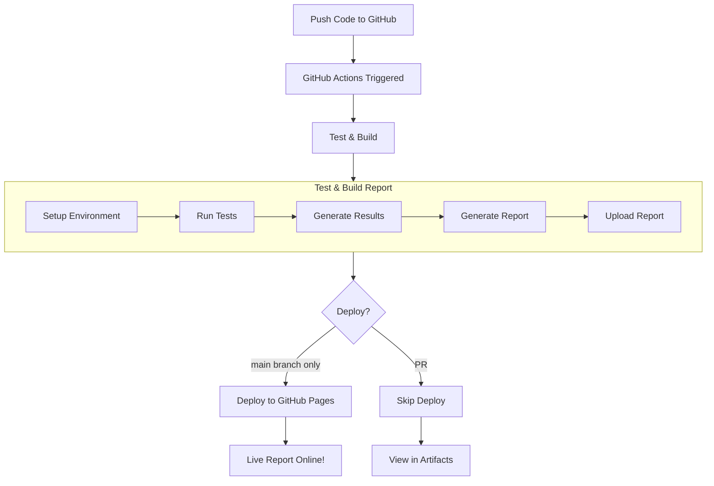

# Guide 5: CI/CD Basics 🤖

**You've tested locally.** Now let's automate it in the cloud!

---

## What You'll Learn

In this guide, you'll:
1. ✅ Understand CI/CD (Continuous Integration/Delivery)
2. ✅ See GitHub Actions in action
3. ✅ View automated test results

**Time needed**: 15 minutes

---

## What is CI/CD? (Simple Version)

**CI/CD** = **Continuous Integration / Continuous Delivery**

Think of it like having a **robot assistant**:
1. 🤖 Watches your code changes
2. ✅ Automatically runs all tests
3. 📊 Creates beautiful reports
4. 🌐 Publishes them online
5. 📈 Tracks history over time

**Without CI/CD**: You manually run tests, create reports, share them
**With CI/CD**: Robot does it all automatically every time you push code!

---

## The Complete Flow



**What this means:**
- **Automatic**: Happens on every push
- **Fast**: Runs in ~15 seconds
- **Free**: GitHub provides it for free
- **Shareable**: Anyone can view results via URL

---

## When Does It Run?

### Every push to main:
```bash
git push origin main
```
→ Tests run automatically!

### Every pull request:
```bash
# Open a PR on GitHub
```
→ Tests run before merge!

### Manual trigger:
- Go to Actions tab
- Click "Run workflow"
- Tests run on demand!

---

## Viewing Test Results

### Step 1: Go to Actions Tab

1. Open your repo on GitHub
2. Click **"Actions"** tab at the top
3. See list of recent workflow runs

**Example:**
```
✅ Tests with Allure Reports  #42  (main)  2 minutes ago
✅ Tests with Allure Reports  #41  (main)  1 hour ago
❌ Tests with Allure Reports  #40  (main)  2 hours ago (failed)
```

### Step 2: Click a Workflow Run

You'll see:
- ✅ Which jobs passed/failed
- ⏱️ How long each job took
- 📝 Logs for each step
- 📦 Artifacts (downloadable files)

### Step 3: View the Report

**Option A: GitHub Pages** (after first run):
```
https://[your-username].github.io/[repo-name]/
```

**Option B: Download Artifact**:
- Scroll to bottom of workflow run
- Click "Artifacts"
- Download and open HTML report

---

## What Gets Tested?

Our CI/CD pipeline runs:

| Stage | What Happens |
|-------|--------------|
| **Setup** | Install Python + dependencies |
| **Lint** | Check code quality (parallel) |
| **Security** | Scan for vulnerabilities (parallel) |
| **Test** | Run all 5 calculator tests |
| **Report** | Generate beautiful Allure report |
| **Deploy** | Publish to GitHub Pages |

**Total time:** ~15 seconds (thanks to caching!)

---

## Pipeline Architecture

Our pipeline has **parallel** and **sequential** stages:

```
┌─────────────────────────────────┐
│      STAGE 1: PARALLEL          │
│  (both jobs start together)     │
└─────────────────────────────────┘
       │              │
       ▼              ▼
   ┌──────┐      ┌─────────┐
   │ Lint │      │Security │
   └──┬───┘      └────┬────┘
      │               │
      └───────┬───────┘
              ▼
┌─────────────────────────────────┐
│     STAGE 2: SEQUENTIAL         │
│  (each waits for previous)      │
└─────────────────────────────────┘
              │
              ▼
         ┌────────┐
         │  Test  │
         └───┬────┘
             │
             ▼
         ┌────────┐
         │ Report │
         └───┬────┘
             │
             ▼
         ┌────────┐
         │ Deploy │
         └────────┘
```

**Why parallel?** Lint and Security can run at the same time = faster!

---

## Benefits of CI/CD

### ✅ Catch Bugs Early
Tests run on every change, so bugs are caught immediately.

### ✅ Consistent Environment
Tests run in a clean environment every time (no "works on my machine").

### ✅ Team Collaboration
Everyone sees test results in one place.

### ✅ Historical Tracking
See how tests perform over time (coming in Guide 6!).

### ✅ Zero Maintenance
Once set up, it runs forever for free!

---

## Understanding the Workflow File

The magic is in `.github/workflows/tests.yml`:

```yaml
name: Tests with Allure Reports

on:
  push:
    branches: [ main ]      # Run on push to main
  pull_request:             # Run on PRs
  workflow_dispatch:        # Manual trigger

jobs:
  test:
    runs-on: ubuntu-latest  # Use Ubuntu VM
    steps:
      - uses: actions/checkout@v4
      - name: Set up Python
        uses: actions/setup-python@v5
        with:
          python-version: '3.9'
          cache: 'pip'      # Cache dependencies!
      - name: Install dependencies
        run: pip install -r requirements.txt
      - name: Run tests
        run: pytest --alluredir=allure-results
      # ... more steps ...
```

**Key points:**
- Triggers on push/PR/manual
- Uses Ubuntu (free)
- Caches dependencies (faster)
- Runs pytest with Allure

---

## Try It Yourself!

### Challenge 1: Trigger a Workflow

1. Make a small change to README
2. Commit and push:
   ```bash
   git add README.md
   git commit -m "Update README"
   git push
   ```
3. Go to Actions tab on GitHub
4. Watch the workflow run live!

### Challenge 2: View the Report

After workflow completes:
1. Check the deployment link
2. Or download the artifact
3. Explore the Allure report

### Challenge 3: Break a Test

1. Change `return a + b` to `return a - b` in calculator
2. Push the change
3. Watch CI catch the error!
4. Fix it and push again

---

## Troubleshooting

### Workflow Not Running?

- Check `.github/workflows/tests.yml` exists
- Ensure you pushed to `main` branch
- Check Actions tab for error messages

### Tests Failing?

- Look at workflow logs (click into the failed job)
- Red ❌ means something broke
- Read the error message
- Fix locally and push again

### GitHub Pages Not Working?

- Go to Settings → Pages
- Set Source to "GitHub Actions"
- Wait a few minutes after first run

---

## Key Takeaways

1. **CI/CD = Automated testing in the cloud**
2. **Runs on every push** (no manual work)
3. **Catches bugs before merge**
4. **Free and zero maintenance**

This is **Stage 3** of professional development! 🎯

---

## ✅ You Did It!

You just:
- ✅ Understood CI/CD concepts
- ✅ Triggered automated tests
- ✅ Viewed test results online

**Next Step**: [Guide 6: Advanced Features](06-advanced-features.md)
Learn about Allure reporting, trends, and performance optimization!

---

**Navigation**:
- ⬅️ Previous: [Guide 4: Pre-commit Hooks](04-pre-commit-hooks.md)
- ➡️ Next: [Guide 6: Advanced Features](06-advanced-features.md)
- 🏠 Back to [README](../README.md)
